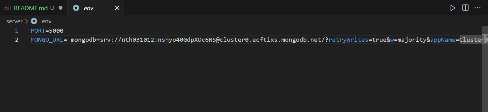
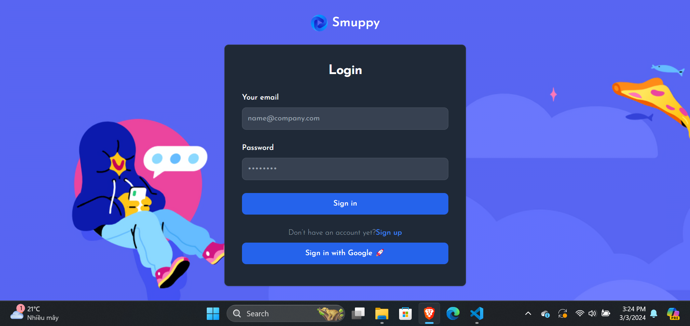
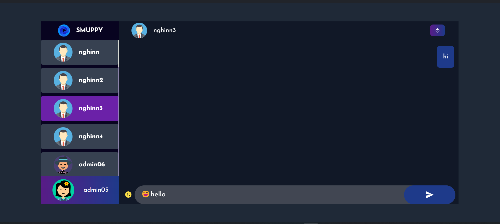

# Smuppy

Smuppy là một ứng dụng trò chuyện trực tuyến thời gian thực.

## Công nghệ sử dụng

**Client:** React, axios, TailwindCSS

**Server:** Node, Express, Socket.io, jwt

**Database:** MongoDB

## Cài đặt

Cài đặt Smuppy với npm

```bash
  git clone https://github.com/nghinn1012/Smuppy.git
```

Tại thư mục clone về, thực hiện cài đặt:

**Front-end**:

```
cd client
npm i
npm start
```

Front-end sẽ được chạy tại địa chỉ localhost:3000 tại trình duyệt của bạn \

**Back-end**:

- Tạo tài khoản MongoDB Atlas
- Tạo một cluster mới
- Connect với server tại file .env (tại folder server):
  
- Sau đó chạy command như sau:

```
npm i
npm start
```

Server sẽ chạy trên cổng 5000 (có thể thay đổi trong file .env)

## Tính năng

- Đăng nhập/Đăng ký tài khoản
  
  
- Chọn/thay đổi ảnh đại diện
  
- Gửi tin nhắn thời gian thực (có hỗ trợ emoji)
  
